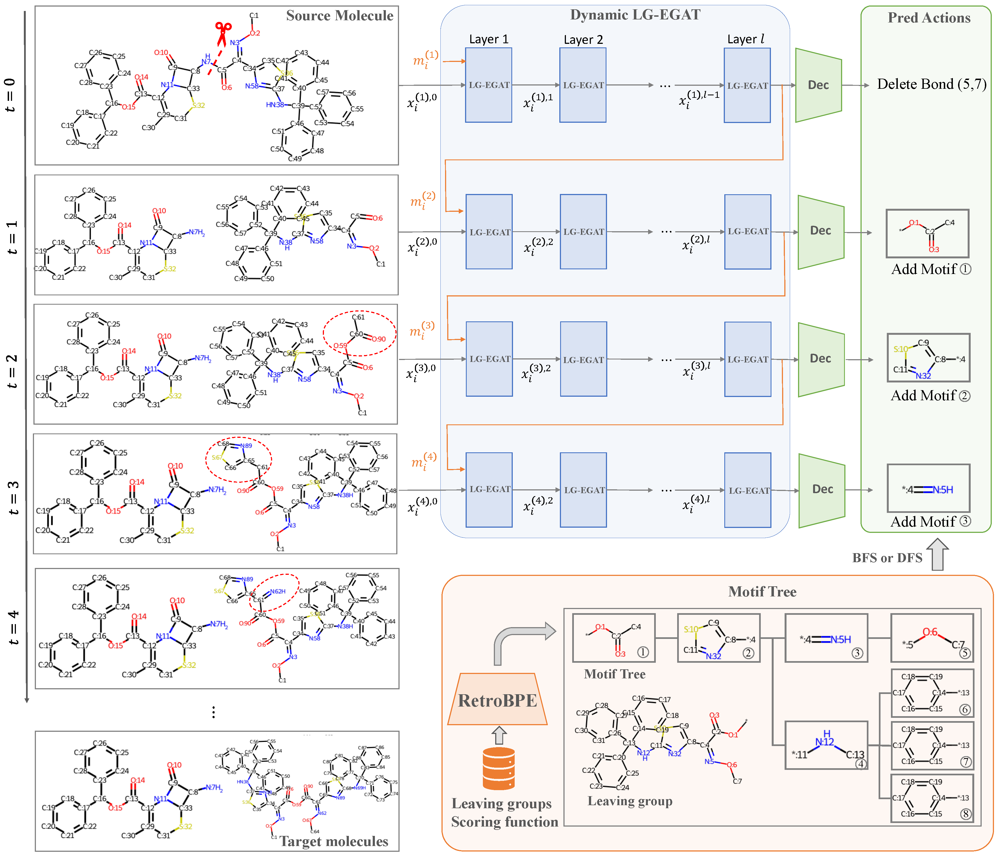
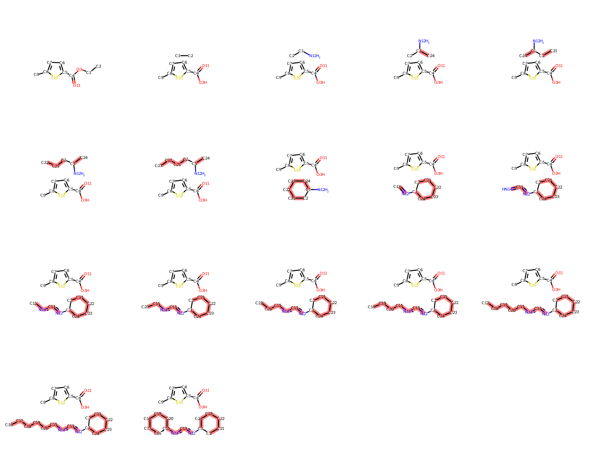
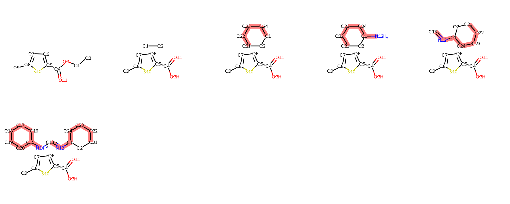
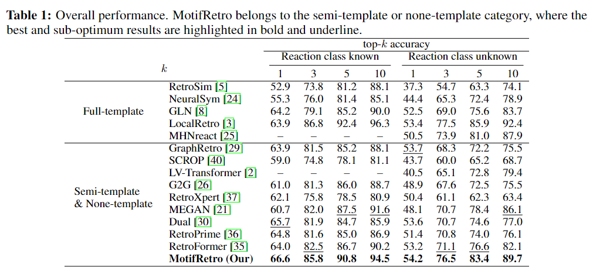

<!-- Improved compatibility of back to top link: See: https://github.com/othneildrew/Best-README-Template/pull/73 -->
<a name="readme-top"></a>


<!-- ABOUT THE PROJECT -->
## 1. Introduction
Is there a unified framework for graph-based retrosynthesis prediction? Through analysis of full-, semi-, and non-template retrosynthesis methods, we discovered that they strive to strike an optimal balance between combinability and consistency: *Should atoms be combined as motifs to simplify the molecular editing process, or should motifs be broken down into atoms to reduce the vocabulary and improve predictive consistency?* Recent works have studied several specific cases, while none of them explores different combinability-consistency trade-offs. Therefore, we propose MotifRetro, a dynamic motif editing framework for retrosynthesis prediction that can explore the entire trade-off space and unify graph-based models. MotifRetro comprises two components: RetroBPE, which controls the combinability-consistency trade-off, and a motif editing model, where we introduce a novel LG-EGAT module to dynamiclly add motifs to the molecule. We conduct extensive experiments on USPTO-50K to explore how the trade-off affects the model performance and finally achieve state-of-the-art performance.

<p align="center">
  
</p>

The overall framework. MotifRetro comprises two main components: RetroBPE, which controls the trade-off between combinability and consistency to construct motif-trees, and a motif editing model. We introduce a novel LG-EGAT module in the motif editing model to dynamically add motifs to the current molecule. At each timestamp, the model predicts an action and applies it to the molecule to generate a new molecule for the next prediction until the "Stop" action is reached.

## 2. Example of edit path

<figure class="half" style="display:flex">
<table>
  <tr>
    <td>
    
      <figcaption>Edit path of MEGAN.</figcaption>
    </td>
    <td>
    
      <figcaption>Edit path of MotifRetro.</figcaption>
    </td>
  </tr>
</table>

</figure>

## 3. Performance
<p align="center">
  
</p>


## Citation

If you are interested in our repository and our paper, please cite the following paper:

```
@article{gao2023motifretro,
  title={MotifRetro: Exploring the Combinability-Consistency Trade-offs in retrosynthesis via Dynamic Motif Editing},
  author={Gao, Zhangyang and Chen, Xingran and Tan, Cheng and Li, Stan Z},
  journal={arXiv preprint arXiv:2305.15153},
  year={2023}
}
```

## Feedback
If you have any issue about this work, please feel free to contact me by email: 
* Zhangyang Gao: gaozhangyang@westlake.edu.cn
* Xingran Chen: chenxran@umich.edu